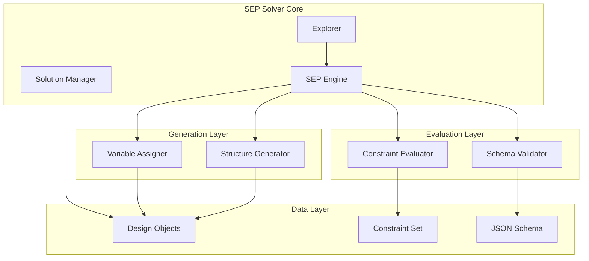

# Design Document: SEP Solver

## Overview

The SEP (Structural Exploration Problem) solver is designed as a modular system that explores both structural configurations and variable assignments under constraints. The architecture emphasizes clear separation of concerns, extensibility, and debuggability over raw performance. The solver operates on JSON-based design objects and provides a pluggable architecture for different exploration strategies.

Key design principles:
- **Modularity**: Clear separation between structure generation, variable assignment, and constraint evaluation
- **Extensibility**: Plugin-based architecture allowing custom components
- **Debuggability**: Comprehensive logging and introspection capabilities
- **Schema-driven**: JSON schema validation ensures data integrity
- **Strategy-based**: Multiple exploration algorithms supported

## Architecture

The system follows a layered architecture with clear interfaces between components:



The architecture separates concerns into distinct layers:
- **Core Layer**: Orchestrates the exploration process
- **Generation Layer**: Creates structures and assigns variables
- **Evaluation Layer**: Validates and evaluates solutions
- **Data Layer**: Manages design objects and constraints

## Components and Interfaces

### SEP Engine

The central orchestrator that coordinates all solver components:

```python
class SEPEngine:
    def __init__(self, schema: dict, constraints: ConstraintSet, config: SolverConfig):
        """Initialize the SEP engine with schema, constraints, and configuration."""
        
    def solve(self, exploration_strategy: str = "breadth_first") -> List[DesignObject]:
        """Main solving method that returns valid solutions."""
        
    def explore_step(self) -> Tuple[DesignObject, bool]:
        """Execute one exploration step, return candidate and validity."""
        
    def get_exploration_state(self) -> ExplorationState:
        """Return current exploration state for debugging."""
```

### Structure Generator

Responsible for generating valid structural configurations:

```python
class StructureGenerator:
    def generate_structure(self, constraints: List[Constraint]) -> Structure:
        """Generate a valid structure satisfying structural constraints."""
        
    def modify_structure(self, structure: Structure, modification: Modification) -> Structure:
        """Apply a modification to an existing structure."""
        
    def get_structure_variants(self, base_structure: Structure) -> List[Structure]:
        """Generate alternative structural configurations."""
```

### Variable Assigner

Handles assignment of values to variables within structures:

```python
class VariableAssigner:
    def assign_variables(self, structure: Structure, strategy: str = "random") -> VariableAssignment:
        """Assign values to all variables in the structure."""
        
    def modify_assignment(self, assignment: VariableAssignment, variable: str, value: Any) -> VariableAssignment:
        """Modify a specific variable assignment."""
        
    def get_assignment_space(self, structure: Structure) -> AssignmentSpace:
        """Return the space of possible assignments for a structure."""
```

### Constraint Evaluator

Evaluates whether design candidates satisfy all constraints:

```python
class ConstraintEvaluator:
    def evaluate(self, design_object: DesignObject) -> EvaluationResult:
        """Evaluate all constraints against a design object."""
        
    def evaluate_constraint(self, constraint: Constraint, design_object: DesignObject) -> bool:
        """Evaluate a single constraint."""
        
    def get_violations(self, design_object: DesignObject) -> List[ConstraintViolation]:
        """Return detailed information about constraint violations."""
```

### Schema Validator

Validates design objects against JSON schema:

```python
class SchemaValidator:
    def __init__(self, schema: dict):
        """Initialize with JSON schema definition."""
        
    def validate(self, design_object: dict) -> ValidationResult:
        """Validate design object against schema."""
        
    def get_schema_errors(self, design_object: dict) -> List[SchemaError]:
        """Return detailed schema validation errors."""
```

## Data Models

### Design Object

The core data structure representing a design:

```python
@dataclass
class DesignObject:
    """Represents a complete design with structure and variable assignments."""
    id: str
    structure: Structure
    variables: VariableAssignment
    metadata: Dict[str, Any]
    
    def to_json(self) -> dict:
        """Serialize to JSON format."""
        
    @classmethod
    def from_json(cls, data: dict) -> 'DesignObject':
        """Deserialize from JSON format."""
        
    def validate_schema(self, validator: SchemaValidator) -> bool:
        """Validate against JSON schema."""
```

### Structure

Represents the structural configuration of a design:

```python
@dataclass
class Structure:
    """Represents the structural configuration of components and relationships."""
    components: List[Component]
    relationships: List[Relationship]
    structural_constraints: List[StructuralConstraint]
    
    def add_component(self, component: Component) -> None:
        """Add a component to the structure."""
        
    def add_relationship(self, relationship: Relationship) -> None:
        """Add a relationship between components."""
        
    def is_valid(self) -> bool:
        """Check if structure satisfies structural constraints."""
```

### Variable Assignment

Represents the assignment of values to variables:

```python
@dataclass
class VariableAssignment:
    """Represents variable assignments within a structure."""
    assignments: Dict[str, Any]
    domains: Dict[str, Domain]
    dependencies: Dict[str, List[str]]
    
    def set_variable(self, name: str, value: Any) -> None:
        """Set a variable value."""
        
    def get_variable(self, name: str) -> Any:
        """Get a variable value."""
        
    def is_consistent(self) -> bool:
        """Check if assignments satisfy dependencies."""
```

### Constraint Set

Manages the collection of constraints:

```python
@dataclass
class ConstraintSet:
    """Collection of constraints that must be satisfied."""
    structural_constraints: List[StructuralConstraint]
    variable_constraints: List[VariableConstraint]
    global_constraints: List[GlobalConstraint]
    
    def add_constraint(self, constraint: Constraint) -> None:
        """Add a constraint to the set."""
        
    def get_constraints_for_component(self, component_id: str) -> List[Constraint]:
        """Get constraints affecting a specific component."""
```

## Error Handling

The system implements comprehensive error handling with specific exception types:

```python
class SEPSolverError(Exception):
    """Base exception for SEP solver errors."""
    pass

class SchemaValidationError(SEPSolverError):
    """Raised when design object fails schema validation."""
    def __init__(self, violations: List[str]):
        self.violations = violations

class ConstraintViolationError(SEPSolverError):
    """Raised when constraints are violated."""
    def __init__(self, violations: List[ConstraintViolation]):
        self.violations = violations

class StructureGenerationError(SEPSolverError):
    """Raised when structure generation fails."""
    pass

class VariableAssignmentError(SEPSolverError):
    """Raised when variable assignment fails."""
    pass
```

Error handling strategy:
- **Validation errors**: Collect all violations and report together
- **Generation errors**: Provide fallback strategies when possible
- **Constraint errors**: Include detailed violation information
- **Recovery**: Attempt graceful degradation where appropriate

## Testing Strategy

The testing approach combines unit tests for specific functionality with property-based tests for universal correctness properties.

### Unit Testing Focus
- Component interface compliance
- Error handling and edge cases
- JSON serialization/deserialization
- Schema validation with invalid inputs
- Specific constraint evaluation examples

### Property-Based Testing Focus
- Universal properties that must hold across all valid inputs
- Comprehensive input coverage through randomization
- Minimum 100 iterations per property test
- Each test tagged with: **Feature: sep-solver, Property {number}: {property_text}**

### Testing Libraries
- **pytest**: Primary testing framework
- **hypothesis**: Property-based testing library
- **jsonschema**: JSON schema validation testing
- **pytest-mock**: Mocking for component isolation

### Test Configuration
- Property tests run with minimum 100 iterations
- Comprehensive logging enabled during tests
- Separate test suites for unit and property tests
- Integration tests for end-to-end workflows

## Correctness Properties

*A property is a characteristic or behavior that should hold true across all valid executions of a system—essentially, a formal statement about what the system should do. Properties serve as the bridge between human-readable specifications and machine-verifiable correctness guarantees.*

Based on the requirements analysis, the following properties must hold for the SEP solver:

### Property 1: Schema Validation Completeness
*For any* design object and JSON schema, the validation process should correctly identify all schema violations and accept all valid objects
**Validates: Requirements 2.1, 2.2, 2.4**

### Property 2: Serialization Round Trip
*For any* valid design object, serializing then deserializing should produce an equivalent object
**Validates: Requirements 2.3**

### Property 3: Structure Generation Validity
*For any* schema and structural constraints, all generated structures should be valid according to both the schema and constraints, and contain both components and relationships
**Validates: Requirements 3.1, 3.2, 3.3**

### Property 4: Structure Modification Preservation
*For any* valid structure and modification operation, the resulting structure should remain valid and be different from the original
**Validates: Requirements 3.5**

### Property 5: Variable Assignment Completeness
*For any* structure with defined variables, the assignment process should assign values to all variables within their valid domains and types
**Validates: Requirements 4.1, 4.2**

### Property 6: Dependency Satisfaction
*For any* structure with variable dependencies, all assigned values should satisfy the dependency relationships
**Validates: Requirements 4.4**

### Property 7: Constraint Evaluation Accuracy
*For any* design object and constraint set, the evaluation should correctly identify all constraint violations and provide specific violation information
**Validates: Requirements 5.1, 5.3, 5.4**

### Property 8: Exploration Solution Validity
*For any* exploration run that finds solutions, all returned solutions should satisfy all constraints and be valid according to the schema
**Validates: Requirements 6.2, 6.4**

### Property 9: Plugin Component Substitution
*For any* pluggable component (structure generator, variable assigner, constraint evaluator), substituting it with a compatible implementation should maintain solver functionality
**Validates: Requirements 8.1**

### Property 10: Configuration Application
*For any* valid configuration parameters, applying them should correctly modify the solver's exploration behavior without breaking core functionality
**Validates: Requirements 8.3**

### Property 11: Error Message Descriptiveness
*For any* validation failure or constraint violation, the error messages should contain specific information about what failed and why
**Validates: Requirements 2.5, 5.4**

### Property 12: Exploration Strategy Differentiation
*For any* two different exploration strategies (breadth-first vs depth-first), they should produce different exploration sequences while both finding valid solutions when they exist
**Validates: Requirements 6.3**